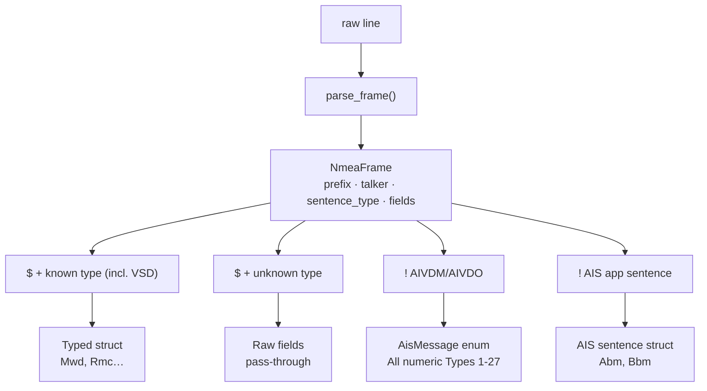

# nmea-0183-rs

Bidirectional NMEA 0183 parser/encoder with AIS decoding and transponder-message encoding, written in Rust.

| | |
| --- | --- |
| **Crate** | `nmea-0183-rs` |
| **Version** | 0.8.7 |
| **MSRV** | 1.85.0 |
| **Edition** | 2024 |
| **Dependencies** | 0 |
| **License** | MIT OR Apache-2.0 |
| **NMEA sentences** | 85 (bidirectional: parse + encode) |
| **AIS application sentences** | 2 (bidirectional: parse + encode) |
| **AIS message types** | All numeric Types 1-27 decoded; Types 1/2/3, 4, 5, 9, 11, 12, 14, 18, 19, 21, 24 and 27 also encoded |

- **Shared frame layer** — handles `$` parametric and `!` encapsulated framing, IEC 61162-450 tag blocks
- **No `nom`, no proc-macro** — `FieldReader`/`FieldWriter` helpers for clean sequential parsing

## Quick start

### Parse an NMEA sentence

```rust
use nmea_0183_rs::{parse_frame, NmeaSentence};

let frame = parse_frame("$IIMWD,046.,T,046.,M,10.1,N,05.2,M*43").unwrap();
let sentence = NmeaSentence::parse(&frame);

match sentence {
    NmeaSentence::Mwd(mwd) => {
        println!("True wind dir: {:?}°", mwd.wind_dir_true);
        println!("Wind speed: {:?} kts", mwd.wind_speed_kts);
    }
    _ => {}
}
```

`parse_frame()` is the permissive API for real-world device input: it accepts
common deviations such as a missing checksum or terminator. Use
`parse_frame_strict()` when the complete wire sentence must satisfy the strict
frame envelope:

```rust
use nmea_0183_rs::{parse_frame, parse_frame_strict};

let observed = parse_frame("$GPRMC,120000.00,A").expect("compatible device frame");
let certified = parse_frame_strict("$GPRMC,120000.00,A*27\r\n")
    .expect("strict wire frame");

assert_eq!(observed.fields, certified.fields);
```

### Encode and send an NMEA sentence

```rust
use nmea_0183_rs::NmeaEncodable;
use nmea_0183_rs::nmea::sentences::Dbt;

let dbt = Dbt {
    depth_feet: Some(7.7),
    depth_meters: Some(2.3),
    depth_fathoms: Some(1.3),
};

let sentence = dbt
    .to_sentence_strict("SD")
    .expect("strict depth sentence");
// "$SDDBT,7.7,f,2.3,M,1.3,F*05\r\n"
```

`encode_frame_strict()` and `to_sentence_strict()` are recommended for conforming
production output. The permissive APIs `encode_frame()` and `to_sentence()`
remain available for reproducing device frames, including frames longer than 82
bytes.

Sentence structs support partial construction, and dispatch enums can be encoded directly:

```rust
use nmea_0183_rs::NmeaSentence;
use nmea_0183_rs::nmea::Dpt;

let value = NmeaSentence::Dpt(Dpt { depth: Some(4.1), ..Default::default() });
let line = value.to_sentence_strict("SD").expect("encode depth");
```

`Default` means absent fields and empty groups, not a valid navigation fix.
`None` is still encoded as an empty field. Supplied NaN/infinite NMEA numbers
now return `EncodeError::NonFiniteNumber`; invalid coordinates retain
`InvalidCoordinate`. `encode_frame()` rejects addresses too short for its parser.
These encoding changes preserve their method signatures. Individual NMEA and
ABM/BBM `parse()` methods now return the struct directly, with optional fields.
See the source-breaking migration guide below.

### Re-encode an unknown sentence

```rust
use nmea_0183_rs::{NmeaSentence, parse_frame};

let frame = parse_frame("\\s:receiver\\!AIXYZ,1,,3").expect("frame");
let value = NmeaSentence::parse(&frame);
let output = value.to_sentence("ignored").expect("re-encode with envelope");
assert_eq!(parse_frame(&output).expect("reparse"), frame);
```

The `Unknown` variants of `NmeaSentence` and `AisSentence` own their prefix,
talker, fields and tag block. They ignore the encoding method's talker argument
and retain their captured envelope, even after the input buffer is dropped.
Typed variants still need the original `NmeaFrame` when preserving the original
prefix, talker or tag block is required.

Unknown variants reuse `NmeaFrame::to_sentence()`, which recomputes both checksums
and emits CRLF. Encoding can reject fields accepted by the permissive parser.
Keep the original input line when exact bytes are required.

### Decode AIS messages

```rust
use nmea_0183_rs::parse_frame;
use nmea_0183_rs::ais::{AisDecodeOutcome, AisParser, AisMessage};

let mut parser = AisParser::new();
let frame = parse_frame("!AIVDM,1,1,,A,13aEOK?P00PD2wVMdLDRhgvL289?,0*26").unwrap();

if let Ok(AisDecodeOutcome::Message(AisMessage::Position(pos))) = parser.decode(&frame) {
    println!("MMSI: {}, lat: {:?}, lon: {:?}", pos.mmsi, pos.latitude, pos.longitude);
}
```

`decode()` distinguishes pending fragments, ignored frames, messages and rejected data:

```rust
use nmea_0183_rs::ais::{AisDecodeOutcome, AisParser};
use nmea_0183_rs::parse_frame;

let frame = parse_frame("!AIVDM,1,1,,A,13aEOK?P00PD2wVMdLDRhgvL289?,0*26")
    .expect("frame");
match AisParser::new().decode(&frame) {
    Ok(AisDecodeOutcome::Message(message)) => println!("{message:?}"),
    Ok(AisDecodeOutcome::Pending) => println!("Awaiting fragments"),
    Ok(AisDecodeOutcome::Ignored) => {},
    Err(error) => eprintln!("AIS decode failed: {error}"),
    Ok(_) => {},
}
```

Use one parser per physical source. `reset()` clears pending VDM and VDO assemblies.
Position reports preserve all timestamp states through
`ais::messages::PositionTimestamp`: `Exact(0..=59)`, `NotAvailable` (60),
`ManualInput` (61), `DeadReckoning` (62), and `Inoperative` (63). Types
1/2/3/9/18/19/21 use this type in both reception and transmission. Calendar
seconds in Types 4/11 remain optional numeric values.

### Encode an AIS transponder message

```rust
use nmea_0183_rs::ais::messages::{NavigationStatus, PositionTimestamp};
use nmea_0183_rs::ais::transmit::{
    AisChannel, AisEncodable, AisTransmitOptions, ClassAPosition, ClassAPositionType,
};

let report = ClassAPosition {
    message_type: ClassAPositionType::PositionReport,
    repeat_indicator: 0,
    mmsi: 244_670_316,
    navigation_status: NavigationStatus::UnderWayEngine,
    rate_of_turn: None,
    sog: Some(10.0),
    position_accuracy: true,
    longitude: Some(4.379_285),
    latitude: Some(51.894_750),
    cog: Some(70.6),
    heading: Some(71),
    timestamp: PositionTimestamp::Exact(5),
    maneuver_indicator: 0,
    raim: false,
    communication_state: 0,
};

let sentences = report
    .to_sentences(AisTransmitOptions::vdm(AisChannel::A))
    .expect("valid Type 1 report");
// `sentences` contains complete, checksummed !AIVDM lines ready for the simulator.
```

`AisTransmitOptions::vdo()` emits `!AIVDO` instead. Messages that require several fragments,
including Type 5 and long Type 12/14 safety text, require `.with_sequence_id(0..=9)`. Every
emitted line is at most 82 characters, including the checksum and CRLF terminator. The crate
constructs sentences only: the simulator owns cadence, TDMA access, and reactions to Type 15.

### Encode an AIS application-layer sentence

```rust
use nmea_0183_rs::ais::sentences::Abm;

let abm = Abm {
    num_frags: Some(1),
    frag_num: Some(1),
    msg_id: Some(0),
    mmsi: Some(123456789),
    channel: Some('1'),
    vdl_msg_num: Some(6),
    payload: Some("testpayload".to_string()),
    fill_bits: Some(0),
};

let sentence = abm.to_sentence("AI").expect("valid AIS sentence");
// "!AIABM,1,1,0,123456789,1,6,testpayload,0*08\r\n"
```

`Abm`, `Bbm` and `AisSentence` also expose `to_sentence_strict()`. Their strict
methods check the frame envelope, not application-field semantics, and work with
the individual `abm` or `bbm` feature without enabling `nmea`.

## Migrating the unreleased API

These changes break source compatibility. The package version remains unchanged
until a release decision; update consumers before using this unreleased code.
Source compatibility is not a constraint anywhere in the public API: obsolete
interfaces are removed instead of retained as aliases or adapters.

- **Sentence parsing:** all 85 NMEA parsers and ABM/BBM return `Self` instead of
  `Option<Self>`. Remove the outer `.expect(...)`, `?`, or `Some` match. Field
  values still use `Option`; frame parsing and AIS decoding keep their existing
  fallible return types.
- **AIS position timestamps:** replace `Some(second)` with
  `PositionTimestamp::Exact(second)` and `None` with `NotAvailable` in
  `ClassAPosition` and `ClassBPosition`. Received `PositionReport`,
  `SarAircraftReport` and `AidToNavigation` now use the same enum. Handle all
  five variants instead of testing for `Some`/`None`. `Exact(60)` and larger
  values fail encoding. Import `PositionTimestamp` from `ais::messages`; the
  old `ais::transmit::PositionTimestamp` path has been removed.
- **Unknown sentences:** manual constructors for `NmeaSentence::Unknown` and
  `AisSentence::Unknown` now require `prefix`, `talker` and `tag_block`. Prefer
  parsing the frame to capture these values. Add `..` to patterns that only
  inspect payload fields. Encoding uses the stored talker, not its argument.
  The unused `EncodeError::MissingFrameContext` variant has been removed.
- **AIS decoding:** `decode()` now returns `Result<AisDecodeOutcome, AisDecodeError>`
  instead of `Option<AisMessage>`. Match `Message`, `Pending`, `Ignored`, or an
  error explicitly. Replace `decode_detailed()` calls with `decode()`.
- **Fragment assembly:** `FragmentCollector::process()` now returns
  `Result<Option<AisPayload>, AisDecodeError>`. `Ok(None)` means pending,
  `Ok(Some(payload))` complete, and `Err` rejected input. Replace
  `process_checked()` calls with `process()`.

```rust
use nmea_0183_rs::{NmeaSentence, parse_frame};
use nmea_0183_rs::nmea::Dbt;

let frame = parse_frame("$SDDBT,7.7,f,2.3,M,1.3,F*05").expect("frame");
// Previously: Dbt::parse(&frame.fields).expect("parse DBT")
let depth: Dbt = Dbt::parse(&frame.fields);
assert_eq!(depth.depth_meters, Some(2.3));

let unknown = NmeaSentence::Unknown {
    prefix: '!',
    talker: "AI".to_owned(),
    sentence_type: "XYZ".to_owned(),
    fields: vec!["1".to_owned()],
    tag_block: None,
};
if let NmeaSentence::Unknown { sentence_type, .. } = &unknown {
    assert_eq!(sentence_type, "XYZ");
}
assert!(unknown.to_sentence("ignored").expect("encode").starts_with("!AIXYZ,"));
```

## Architecture



**Frame layer** strips and validates IEC 61162-450 tag blocks, validates a checksum
when present, and extracts the talker ID and sentence type. `parse_frame()` keeps
device-compatible framing behavior. `validate_sentence()` and
`parse_frame_strict()` additionally require the canonical address, checksum,
terminator, character set, escape grammar, and 82-byte sentence limit.

Strict validation covers the shared frame envelope only. It does not add
formatter-specific semantic validation, serial baud or electrical checks,
transmission cadence, timeouts, or multipart reassembly for non-AIS formatters
such as RTE, TXT, ALC, ALF, TUT, and SMV.

**NMEA content** uses `FieldReader`/`FieldWriter` for sequential field parsing and encoding. Each sentence type is a standalone struct with `parse()`, `encode()`, and `to_sentence()`. Parsing is infallible and lenient: `parse()` returns the sentence struct directly, mapping missing or malformed fields to `None`. This is intentional for marine instruments that often produce partial data.

**AIS content** decodes AIVDM/AIVDO 6-bit ASCII armor into a bitstream, handles multi-fragment reassembly, and extracts typed fields. `ais::transmit` encodes complete `!AIVDM` or `!AIVDO` lines for Types 1/2/3, 4, 5, 9, 11, 12, 14, 18, 19, 21, 24 and 27. It owns sentence fragmentation, while the simulator remains responsible for choosing its emission cadence. The `!`-prefixed AIS application sentences ABM and BBM live under `ais::sentences`. VSD is a conventional NMEA sentence (`$--VSD`) exposed under `nmea::sentences`.

## Supported types

### NMEA 0183 sentences (bidirectional) — [full coverage list](SENTENCES.md)

| Category           | Sentences             |
| ------------------ | --------------------- |
| Position           | DTM, RMC, GGA, GLL, GNS |
| Satellites         | GBS, GSA, GSV, GST    |
| Wind               | MWD, MWV, VPW, VWR, VWT    |
| Heading            | HDT, HDG, HDM, THS    |
| Course & Speed     | RPM, VBW, VDR, VLW, VTG, VHW    |
| Depth              | DPT, DBT, DBS, DBK    |
| Steering           | HSC, ROT, RSA         |
| Environment        | MDA, MTA, MTW, XDR¹        |
| Waypoints & Routes | AAM, APB, BEC, BOD, BWC, BWR, BWW, RMB, RTE, WCV, WPL, XTE |
| Radar / Targets    | OSD, RSD, TLL, TTM    |
| Safety & Alarms    | ACK, ACN, ALA, ALC, ALF, ALR, ARC, DOR, DSC, DSE, EVE, FIR, HBT |
| AIS interface      | VSD (`$--VSD`)        |
| Communication      | TXT                   |
| Time               | ZDA                   |
| Proprietary        | PASHR, PGRME, PSKPDPT |

¹ `Xdr` has an additional `to_sentences() -> Result<Vec<String>, EncodeError>` method that automatically splits many measurements into multiple sentences to stay within the 82-character NMEA line limit.

### AIS application sentences (bidirectional)

| Sentences |
| --------- |
| ABM, BBM  |

### AIS messages — [full type list](SENTENCES.md#ais)

| Type(s) | Decoded struct      | Encoded model | Description                                          |
| ------- | ------------------- | ------------- | ---------------------------------------------------- |
| 1, 2, 3 | `PositionReport`    | `ClassAPosition` | Class A position report                           |
| 4       | `BaseStationReport` | `BaseStation` | Base station UTC + position                          |
| 5       | `StaticVoyageData`  | `ClassAStaticVoyage` | Static and voyage data (Class A)                |
| 6       | `BinaryAddressed`   |               | Addressed binary message (DAC/FID + data)            |
| 7, 13   | `BinaryAck`         |               | Binary / safety acknowledge                          |
| 8       | `BinaryBroadcast`   |               | Binary broadcast message (DAC/FID + data)            |
| 9       | `SarAircraftReport` | `SarAircraft` | Standard SAR aircraft position                       |
| 10      | `UtcDateInquiry`    |               | UTC/date inquiry                                     |
| 11      | `UtcDateResponse`   | `UtcDateResponse` | UTC/date response (mobile station)                |
| 12      | `SafetyAddressed`   | `SafetyAddressed` | Addressed safety-related message                   |
| 14      | `SafetyBroadcast`   | `SafetyBroadcast` | Safety-related broadcast message                   |
| 15      | `Interrogation`     |               | Interrogation (request data from vessel)             |
| 16      | `AssignmentModeCommand` |            | Assigned mode command                                |
| 17      | `DgnssBroadcast`    |               | DGNSS correction broadcast                           |
| 18      | `PositionReport`    | `ClassBPosition` | Class B standard position                         |
| 19      | `PositionReport`    | `ClassBExtendedPosition` | Class B+ extended position             |
| 20      | `DataLinkManagement` |              | FATDMA slot reservations                             |
| 21      | `AidToNavigation`   | `AidToNavigation` | Aid-to-navigation report (buoys, beacons)          |
| 22      | `ChannelManagement` |               | Channel management                                   |
| 23      | `GroupAssignment`   |               | Group assignment command                             |
| 24      | `StaticDataReport`  | `ClassBStaticPartA`, `ClassBStaticPartB` | Static data report (Class B) |
| 25      | `BinarySingleSlot`  |               | Single-slot binary message                           |
| 26      | `BinaryMultiSlot`   |               | Multiple-slot binary message                         |
| 27      | `LongRangePosition` | `LongRangePosition` | Long range position (satellite AIS, 1/10 minute precision) |

### Key improvements over existing crates

| Issue                  | `nmea` 0.7 / `ais` 0.12             | `nmea-0183-rs`                               |
| ---------------------- | ----------------------------------- | ---------------------------------------- |
| NMEA sentence coverage | ~10 types, rest manual              | 85 NMEA types + 2 AIS application sentences |
| AIS message coverage   | ~5 types                            | All numeric Types 1-27                    |
| Encoding               | Read-only                           | All NMEA + Types 1/2/3, 4, 5, 9, 11, 12, 14, 18, 19, 21, 24, 27 |
| Error distinction      | Can't tell unsupported vs malformed | Frame errors vs content errors           |
| AIS lat/lon precision  | `f32` (11m error)                   | `f64`                                    |
| AIS sentinels          | 91/181/511 leak to caller           | Filtered to `None` at decode             |
| Tag blocks             | Manual stripping                    | Built into frame layer                   |
| Dependencies           | `nom` (AIS)                         | Zero                                     |

## Features

```toml
[dependencies]
nmea-0183-rs = "0.8"
```

| Feature                                                                                                                                                                                                                                | Default    | Enables                    |
| -------------------------------------------------------------------------------------------------------------------------------------------------------------------------------------------------------------------------------------- | ---------- | -------------------------- |
| `nmea`                                                                                                                                                                                                         | yes        | All 85 NMEA sentence types |
| `ais`                                                                                                                                                                                                                                  | yes        | 24 AIS message decoders, transponder encoding, and ABM/BBM application sentences |
| `positioning`                                                                                                                                                                                                                          | via `nmea` | GGA, GLL, RMC, GNS         |
| `speed`                                                                                                                                                                                                                                | via `nmea` | VTG, VHW, VBW, RMC, RPM, VDR |
| `heading`                                                                                                                                                                                                                              | via `nmea` | HDG, HDM, HDT, THS         |
| `wind`                                                                                                                                                                                                                                 | via `nmea` | MWD, MWV                   |
| `depth`                                                                                                                                                                                                                                | via `nmea` | DBT, DBS, DBK, DPT         |
| `aam`, `ack`, `acn`, `ala`, `alc`, `alf`, `alr`, `arc`, `apb`, `bec`, `bod`, `bwc`, `bwr`, `bww`, `dbk`, `dbs`, `dbt`, `dor`, `dpt`, `dsc`, `dse`, `dtm`, `eve`, `fir`, `gbs`, `gga`, `gll`, `gns`, `gsa`, `gsv`, `gst`, `hbt`, `hdg`, `hdm`, `hdt`, `hsc`, `mda`, `mta`, `mtw`, `mwd`, `mwv`, `osd`, `pashr`, `pcdin`, `pgrme`, `pgrmt`, `phtro`, `pklid`, `pklds`, `pklsh`, `pknds`, `pknid`, `pknsh`, `pkwdwpl`, `pmtk`, `prdid`, `psoncms`, `pskpdpt`, `rmb`, `rmc`, `rot`, `rpm`, `rsa`, `rsd`, `rte`, `tlb`, `tll`, `ttd`, `ttm`, `txt`, `vbw`, `vdr`, `vhw`, `vlw`, `vpw`, `vsd`, `vtg`, `vwr`, `vwt`, `wcv`, `wpl`, `xdr`, `xte`, `zda` | via `nmea` | Individual NMEA sentence types |
| `abm`, `bbm` | via `ais` | Individual AIS application-layer sentence types |

Use a group feature for common use cases:

```toml
# Only positioning sentences (GGA, GLL, RMC, GNS), no AIS
nmea-0183-rs = { version = "0.8", default-features = false, features = ["positioning"] }
```

Cherry-pick individual sentences you need:

```toml
nmea-0183-rs = { version = "0.8", default-features = false, features = ["rmc", "mwd"] }
```

NMEA-only (no AIS, all sentences):

```toml
nmea-0183-rs = { version = "0.8", default-features = false, features = ["nmea"] }
```

## Coordinate conversion

NMEA sentences encode lat/lon as `DDMM.MMMM`; AIS uses decimal degrees. Two helpers bridge the gap:

```rust
use nmea_0183_rs::nmea::{ddmm_to_decimal, decimal_to_ddmm};

// Parse a GGA latitude field: "4807.038" N → 48.1173°
let lat = ddmm_to_decimal(4807.038); // → 48.1173

// Encode back for a sentence
let ddmm = decimal_to_ddmm(48.1173); // → 4807.038
```

Apply the N/S / E/W sign separately (negate for S or W), and do not silently
default a missing or unrecognized hemisphere to north/east:

```rust
use nmea_0183_rs::nmea::{Rmc, ddmm_to_decimal};

let fix = Rmc { lat: Some(4807.038), ns: Some('S'), ..Default::default() };
let latitude = match (fix.lat, fix.ns) {
    (Some(raw), Some('N')) => Some(ddmm_to_decimal(raw)),
    (Some(raw), Some('S')) => Some(-ddmm_to_decimal(raw)),
    _ => None,
};
assert!(latitude.expect("known hemisphere") < 0.0);
```

Longitude uses the same pattern with E/W. The arithmetic helpers do not validate
coordinate ranges or fix validity; those checks remain the consumer's responsibility.

## Documentation

| File                               | Purpose                                                           |
| ---------------------------------- | ----------------------------------------------------------------- |
| [CONTRIBUTING.md](CONTRIBUTING.md) | Getting started, TDD workflow, test rules, adding a sentence type |
| [SENTENCES.md](SENTENCES.md)       | Full NMEA / AIS coverage matrix                                   |
| [CHANGELOG.md](CHANGELOG.md)       | Release history                                                   |
| [AGENTS.md](AGENTS.md)             | API surface, struct fields, and patterns (optimized for LLMs)     |

## License

MIT OR Apache-2.0
